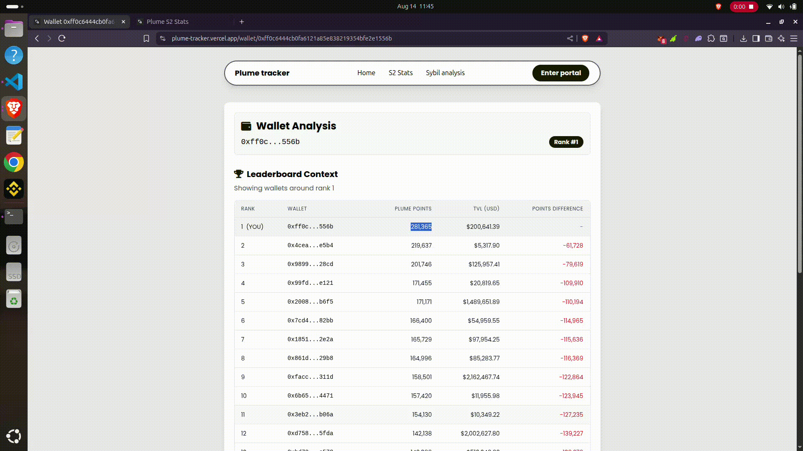
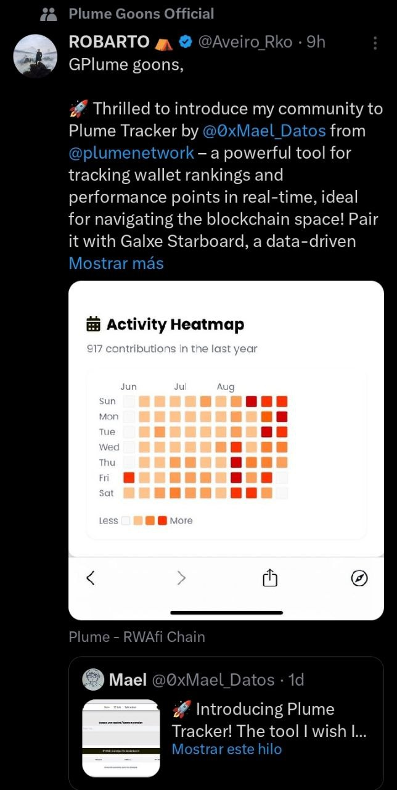
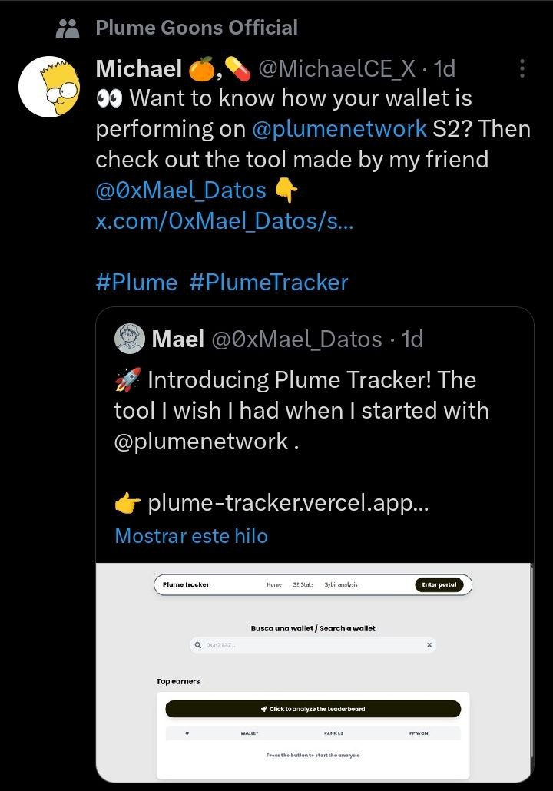
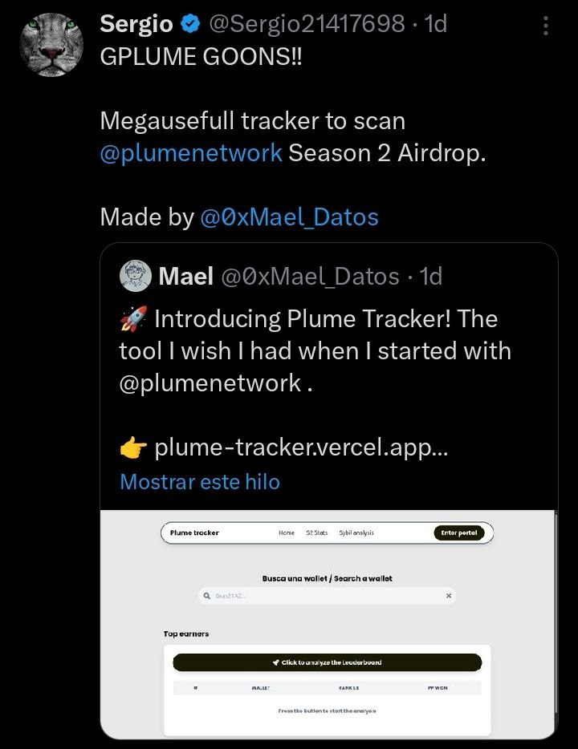
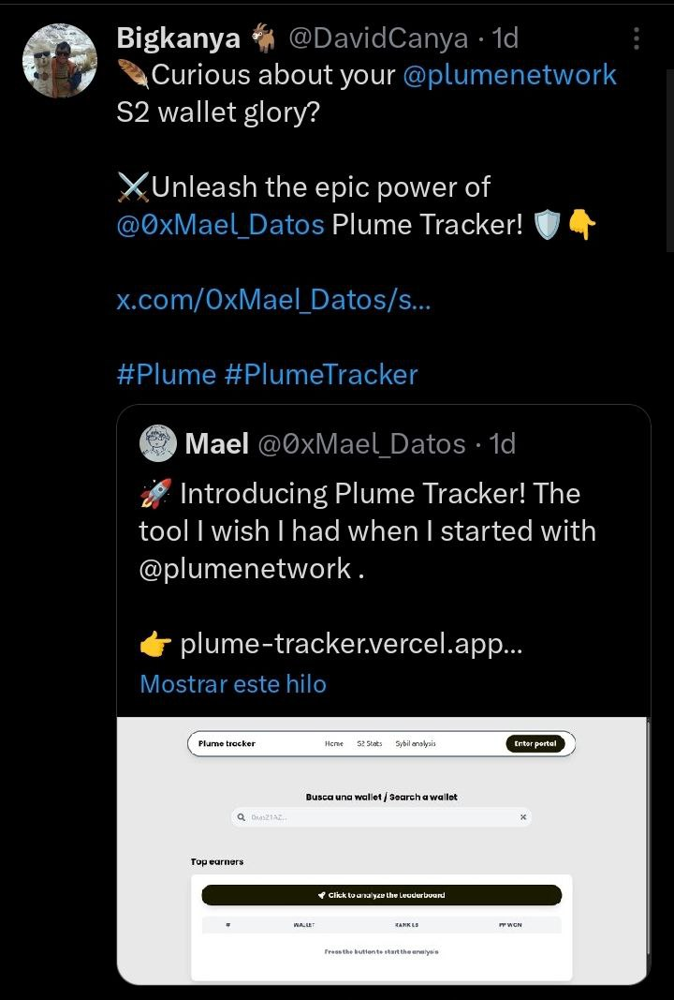
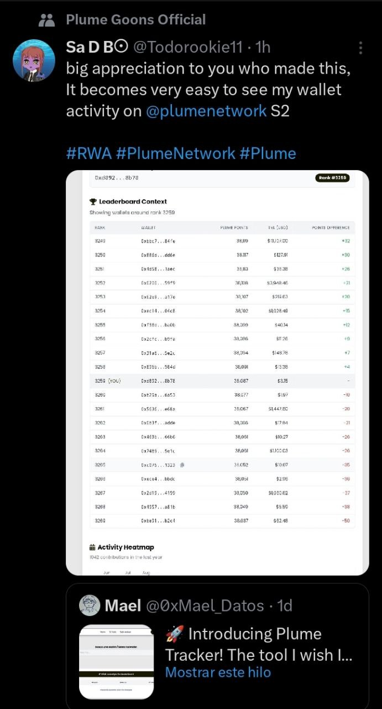
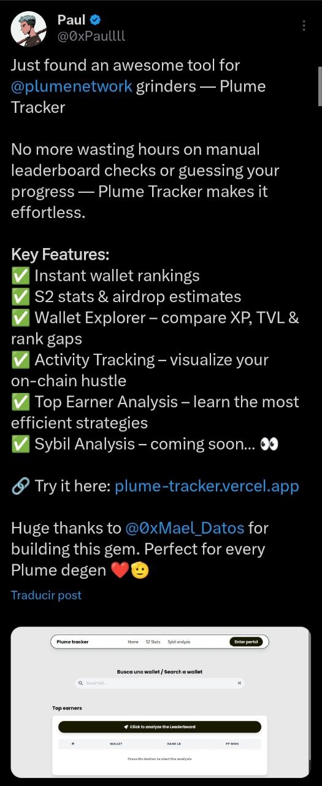

# 🌱 Plume Tracker

Construí esta herramienta porque estaba harto de perder tiempo analizando wallets manualmente en Google Colab o directamente de las APIs o incluso del [Leaderboard de plume](https://portal.plume.org/leaderboard). Lo que comenzó como scripts desordenados para mi [diario de un Farmer](https://github.com/IsmaelDatos/Diario_de_un_farmer/tree/main/Plume_network), se convirtió en esta web para ayudar a otros farmers como yo.

**Puedes probar y ver la web aqui abajo** ☕

➡️ **[Visita la web aquí](https://plume-tracker.vercel.app)** ⬅️

*"De un farmer, para farmers"*

---

# 🔍 ¿Qué puedes hacer con Plume Tracker?

### 1️⃣ Consultar la información de una wallet
Consulta numero en el leaderboard, wallet, puntos, TVL y la diferencia de puntos entre la wallet buscada y las mas cercanas a esta.

 

---

### 2️⃣ Ver los Top Earners del día
Descubre quiénes han acumulado más puntos en las últimas 24 horas.

 

---

### 3️⃣ Explorar las estadísticas de la Season 2 del airdrop
Puntos totales (actualizados), allocation para la S2 y una calculadora lineal para hacer especulaciones.

 

---

## 🛠️ Tecnologías Utilizadas

### Backend

  
  

### Frontend

  
  
  
  

### Infraestructura

  
  

---

Sigo mejorando esta herramienta mientras documento mi avance en la season 2 de plume en:  
[📒 Diario de un Farmer - Plume Network](https://github.com/IsmaelDatos/Diario_de_un_farmer/tree/main/Plume_network)

---

## 📸 Galería de comentarios y reacciones

Algunas capturas de la recepción de **Plume Tracker** en X:

  
  
  

  
  
  

