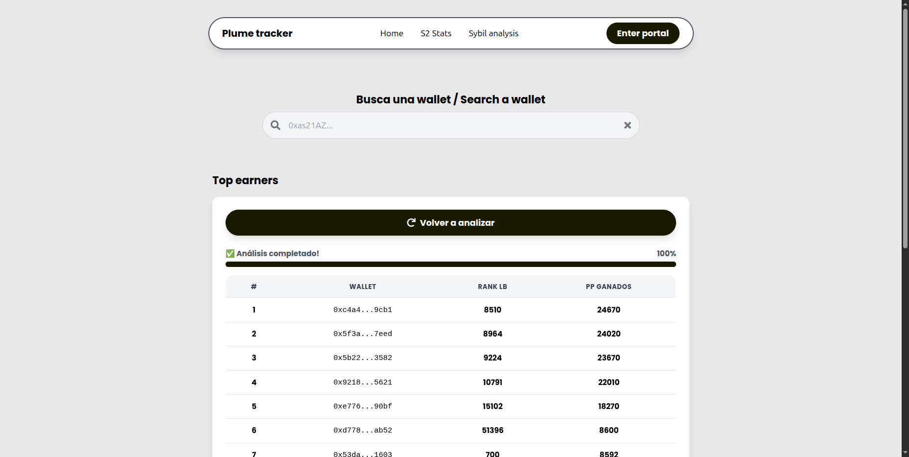

# 🌱 Plume Tracker

Construí esta herramienta porque estaba harto de perder tiempo analizando wallets manualmente en Google Colab o directamente de las APIs o incluso del [Leaderboard de plume](https://portal.plume.org/leaderboard). Lo que comenzó como scripts desordenados para mi [diario de un Farmer](https://github.com/IsmaelDatos/Diario_de_un_farmer/tree/main/Plume_network), se convirtió en esta web para ayudar a otros farmers como yo.

**Puedes probar y ver la web aqui abajo** ☕

➡️ **[Visita la web aquí](https://plume-tracker.vercel.app)** ⬅️

*"De un farmer, para farmers"*

---

## 🛠️ Tecnologías Utilizadas

### Data Science

  
  
  

### Backend

  

### Frontend

  
  
  
  

### Infraestructura

  
  

---

Sigo mejorando esta herramienta mientras documento mi avance en la season 2 de plume en:  
[📒 Diario de un Farmer - Plume Network](https://github.com/IsmaelDatos/Diario_de_un_farmer/tree/main/Plume_network)
