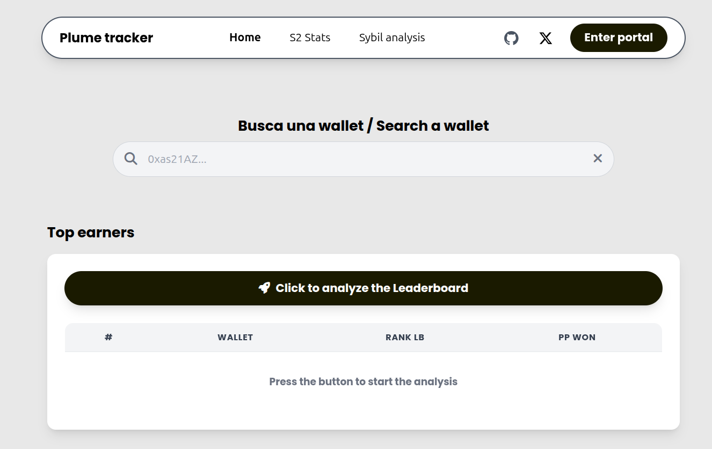
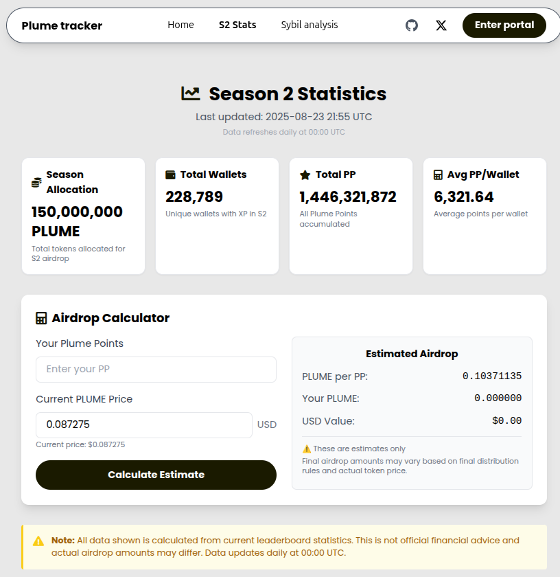
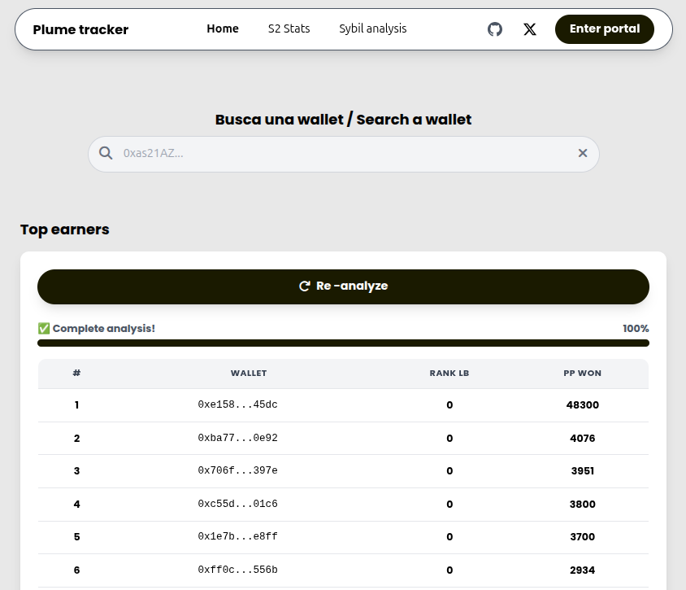
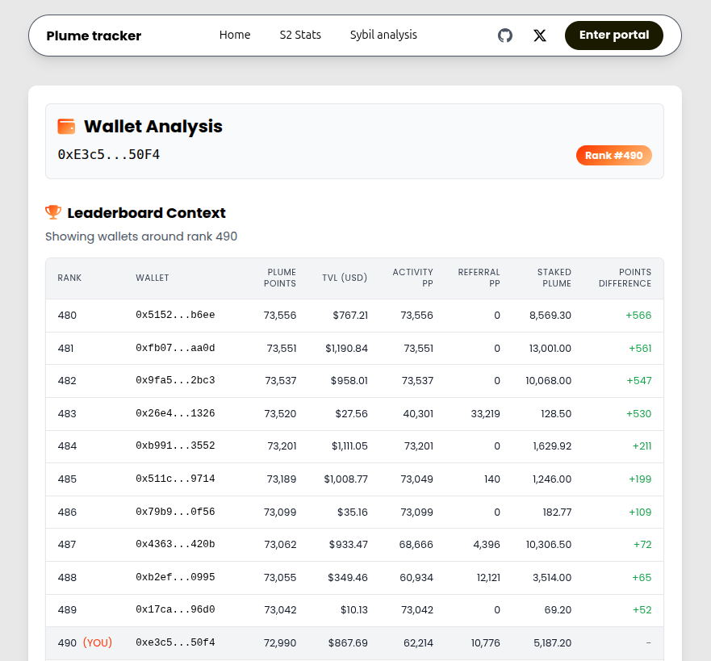
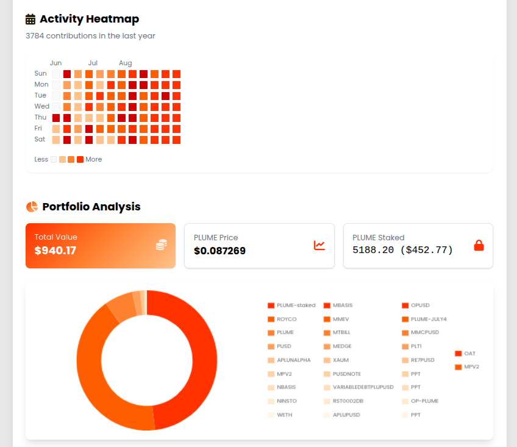

<h1 align="center">
  
   Plume Tracker
</h1>

> ⚠️ **Disclaimer**  
> Este proyecto es una iniciativa **comunitaria e independiente**.  
> **No es un producto oficial de Plume Network ni guarda relación alguna con su equipo.**  
> El uso de esta herramienta es únicamente con fines informativos y educativos.

Construí esta herramienta porque estaba harto de perder tiempo analizando wallets manualmente en Google Colab, APIs o directamente desde el [Leaderboard de Plume](https://portal.plume.org/leaderboard).  
Lo que empezó como simples scripts para mi [📒 Diario de un Farmer](https://github.com/IsmaelDatos/Diario_de_un_farmer/tree/main/Plume_network), se transformó en una web pensada para ayudar a otros farmers como yo.

👉 **Puedes probar la web aquí** 

➡️ **[Plume tracker](https://plume-tracker.fly.dev/)** ⬅️

## *"De un farmer, para farmers"* 

---

## 🙌 Gracias

Originalmente esta página estaba en **Vercel**, pero a los **3 días** tuvimos tantos usuarios que tuvimos que mudarnos a **Fly.io**. Nada mal. 
Estoy muy agradecido por el apoyo de la comunidad, porque este proyecto nació para uso personal y terminó creciendo mucho más de lo esperado.  

---

### Página Principal
  
En el index puedes ver la entrada principal a la web.

---

### Estadísticas de la Season 2

  
Aquí se muestran las estadísticas de la Season 2, organizadas para facilitar el análisis.

---

### Detección de Sybils

  

Cada burbuja representa una red de farming, y su tamaño corresponde al número de wallets vinculadas. Perfecto para identificar patrones sospechosos.Estos tramposos actuan de la siguiente forma, crean una wallet root,despues crean mas wallets y con el referido de la primera refieren n cantidad de wallets mas, posteriormente, toman el referido de las n wallets y se refieren mas wallets. No son muy listos a pesar de todo.

---

### Top Earners
  
Con un clic puedes ver la tabla de **top earners**, ordenados y listos para revisar.

---

### Búsqueda de Wallets
  
  
Así se ve al consultar cualquier wallet. El usuario obtiene un desglose claro y visual de su información.

---

## 🛠️ Tecnologías Utilizadas

### Backend

  
  

### Frontend

  
  
  
  

### Infraestructura

  
  

---

## 🚀 En constante mejora
Sigo optimizando esta herramienta mientras documento mi progreso en la Season 2 de Plume en:  
[📒 Diario de un Farmer - Plume Network](https://github.com/IsmaelDatos/Diario_de_un_farmer/tree/main/Plume_network)
